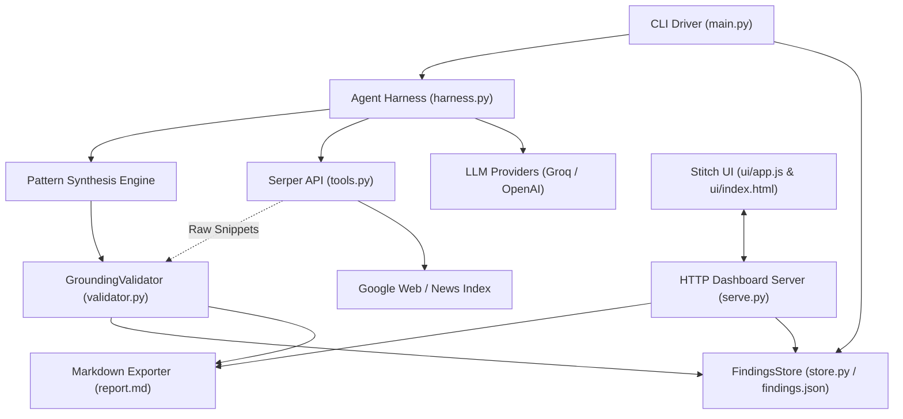

# ARCHITECTURE.md — System Architecture & Component Design

## 1. High-Level System Architecture



---

## 2. Component Pipeline & Data Flow

### Phase 1: Investigation & Discovery (`harness.py`)
1. **Client Seeding**: `clients.py` feeds clients (e.g. PlayerZero, Wispr Flow) into the harness.
2. **ReAct Loop**:
   - The LLM receives the investigation prompt and tool definitions.
   - The LLM issues a function call (`web_search` or `news_search`).
   - The `Budget` manager decrements the global tool budget.
   - `SerperClient` dispatches HTTP requests to `google.serper.dev`.
   - Raw results (titles, links, snippets) are fed back into the conversation history.
   - When finished or out of budget, the agent summarizes findings for that client.
3. **Incremental Caching**: Each completed client and its raw tool output are saved to `findings.json`.

### Phase 2: Synthesis & Pattern Extraction (`harness.py`)
1. Summaries from all investigated clients are injected into the synthesis prompt.
2. The LLM generates the cross-launch pattern report, explicitly highlighting:
   - Shared tactics & channel reliance.
   - Narrative progression.
   - Data gaps (what the evidence does *not* support).

### Phase 3: Deterministic Grounding Audit (`validator.py`)
1. **Corpus Construction**: Collects all raw search tool results captured across all client turns.
2. **Entity Ingestion**: Indexes all URLs, domain paths, and `@handles`.
3. **Claim Extraction**: Uses regex pattern matchers to extract claims from the synthesis text:
   - Creator handles (`@username`)
   - Calendar dates (`YYYY-MM-DD`, month names)
   - Article links
4. **Verification Step**: Matches each claim against the indexed corpus without LLM intervention.
5. **Ledger Generation**: Categorizes claims into `Verified` or `Unverified [FLAGGED]` and computes the Grounding Score.

### Phase 4: Serving & Visualization (`serve.py` + `ui/`)
1. `serve.py` spins up a zero-dependency HTTP server on port 8080.
2. Serves `index.html`, `style.css`, and `app.js`.
3. Delivers live data by reading directly from `findings.json` and `report.md`.
4. The dashboard renders dynamic metrics, filterable audit tables, and claim status pills.

---

## 3. Directory Layout & Module Responsibilities

```
c:\Users\pranj\Documents\Hallucheck\
├── AGENTS.md            # Agent operational rules and constraints
├── PRD.md               # Product Requirements Document
├── ARCHITECTURE.md      # System blueprint & component data flow
├── SCHEMA.md            # Data models and JSON schemas
├── API.md               # CLI flags and HTTP endpoints
├── TASKS.md             # Implementation roadmap & checklist
│
├── main.py              # CLI entrypoint & pipeline orchestrator
├── harness.py           # ReAct loop, LLM abstractions, and Budget
├── validator.py         # Deterministic regex grounding auditor
├── tools.py             # Serper.dev Google search/news client & tool schemas
├── store.py             # FindingsStore manager for findings.json
├── clients.py           # Seed client registry (Social Capital portfolio)
├── serve.py             # Lightweight HTTP server for UI dashboard
├── test_harness.py      # Pytest test suite for tools, budget, and validator
│
├── findings.json        # Persistent cache of tool results & audit ledger
├── report.md            # Markdown report output with audit ledger
│
├── ui/                  # Stitch UI Dashboard
│   ├── index.html       # Single-page dashboard template
│   ├── style.css        # Responsive dark theme styling
│   └── app.js           # Client-side data fetching & UI rendering
│
└── graphify-out/        # Automated code & AST dependency knowledge graph
```
